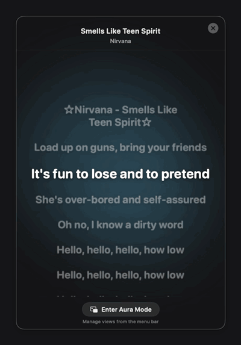

# AuraLyrics

Floating, always-on-top synchronized lyrics for Spotify on macOS. Native Swift and SwiftUI, no third-party libraries, and no Spotify API keys to set up.


**Aura mode** — three lines, no window, nothing to look at but the words. The halo around the current line is drawn from the album artwork and cross-fades when the track changes.



**Lyrics view** — the whole song, with the same album colour spread into an ambient background.

## Install

```bash
brew install --cask ozcberkay/tap/auralyrics
```

Homebrew is the recommended route: the cask clears the quarantine flag, so the app just opens. Naming the tap in full is what makes this a single command — Homebrew taps it and trusts that one cask because you asked for it by name. `brew tap` first, then `brew install --cask auralyrics`, needs an extra `brew trust ozcberkay/tap` in between.

**Downloading the archive instead?** Releases are signed ad-hoc, not notarized, so macOS blocks the first launch. Open the app once, then go to **System Settings → Privacy & Security** and click **Open Anyway** next to the AuraLyrics warning. (Right-click → Open no longer bypasses this on macOS 15 and later.)

## Usage

1. Play a song in **Spotify**.
2. Launch **AuraLyrics**. macOS will ask for permission to control Spotify — this is how the app reads the current track; grant it.
3. Lyrics appear in the floating window and follow playback.
4. The menu bar icon toggles the window, switches between Lyrics and Aura mode, changes theme and size, and controls playback.

## Features

- **Two views, one keystroke apart.** The lyrics view scrolls the whole song over an ambient background coloured by the album art. Aura mode strips it to three borderless lines — previous, current, next — floating over whatever you are working on, with the album colour reduced to a halo on the words themselves so it never covers your screen.
- **Always-on-top** — both views stay visible over other apps.
- **Synchronized lyrics** — time-synced where available, plain text as a fallback.
- **Menu bar controls** — play/pause, next, previous, current track, theme and size.
- **Two-layer cache** — memory and disk, so a song you have already played appears instantly.
- **No accounts, no API keys, no telemetry.**

## Requirements

- macOS 14.0 (Sonoma) or later
- Spotify desktop app
- Spotify only. Apple Music users already get lyrics in the Music app; supporting it needs a different integration that AuraLyrics does not have.

## Development

```bash
git clone https://github.com/auraworkshq/AuraLyrics.git
cd AuraLyrics
swift build
swift test
swift run AuraLyrics
```

Swift 5.9 / Xcode 15 or later. To produce a distributable `.app` and its SHA256, run `scripts/build_release_auralyrics.sh`.

The package targets Swift 5 language mode and builds with zero warnings. It also compiles under full Swift 6 language mode. Building Swift 5 with `-strict-concurrency=complete` still reports diagnostics in `WindowManager` about calling main-actor `NSWindow` methods from a nonisolated context; Swift 6's region-based isolation analysis accepts the same code, so these are not tracked as defects.

## Lyrics, privacy and legal

Lyrics come from the [LRCLIB](https://lrclib.net) community database. AuraLyrics does not host, store or redistribute a lyrics catalogue of its own, and displays whatever LRCLIB returns.

What leaves your machine: the track name, artist, album and duration of the song you are playing, sent to lrclib.net to look up its lyrics, plus a request to Spotify's image CDN for the album artwork. Nothing else. There is no analytics, no account, no crash reporting and no server operated by this project. Track metadata and fetched lyrics are cached on your own disk.

AuraLyrics is an independent project and is not affiliated with, endorsed by, or sponsored by Spotify or LRCLIB. It reads playback state through Spotify's own scripting interface and never handles your Spotify credentials.

Rights holders: for a takedown or correction request about lyrics content, open an issue on this repository — note that the content itself is served by lrclib.net, not by this app.

## License

MIT — see [LICENSE](LICENSE). This covers the AuraLyrics source code only, not any lyrics it displays.
